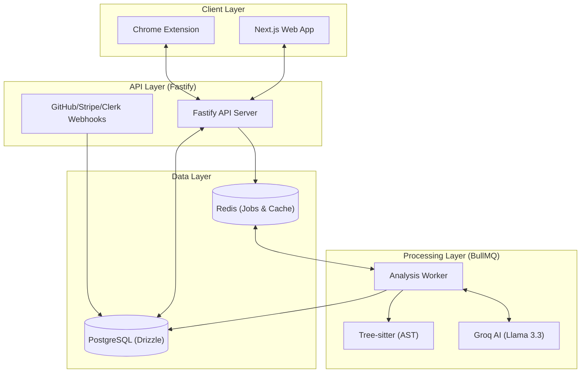

# CodeSage 🧙‍♂️

<p align="center">
  
</p>

> **The AI-Powered Code Optimization & Analysis Engine** 🚀

CodeSage is a production-grade SaaS platform designed to transform code quality. It leverages advanced AST (Abstract Syntax Tree) parsing and Large Language Models to analyze, refactor, and optimize code with surgical precision. Whether you're pasting code into our web dashboard, reviewing a Pull Request on GitHub, or browsing StackOverflow with our extension, CodeSage acts as your automated senior architect. 🏗️

---

## ✨ Core Functionality

### 🌐 1. Web UI & Dashboard
The central hub for your code health.
- **💬 AI Chat Assistant**: Discuss specific findings with a context-aware AI that understands your code's structure.
- **🔍 Categorized Findings**: Detailed reporting of **Issues** 🔴, **Warnings** 🟡, and **Info-level Suggestions** 🔵 with precise line-snapping.
- **📊 Advanced Complexity Metrics**: Visualize **Cyclomatic** and **Cognitive Complexity** per file, alongside a **Production Readiness** score.
- **🔄 Interactive Diff Previews**: Side-by-side or inline code comparison using the **Monaco Editor** to visualize AI-suggested refactors.
- **📜 Analysis History**: A comprehensive, searchable history of every code analysis performed in your workspace.
- **🤝 Team Collaboration**: Manage team members, invite collaborators, and share analysis results with role-based access.
- **🍉 Premium UI (Watermelon UI)**: Highly interactive and aesthetic components implemented across the **Feature Carousel**, **Payment Flows**, and the **FAQ Section**.

### 🧩 2. Browser Extension
Bring professional code review to every tab.
- **🌍 On-Page Analysis**: Works seamlessly on GitHub, GitLab, StackOverflow, and internal code tools.
- **⚡ One-Click Review**: Instantly detect O(n²) loops, security vulnerabilities, and anti-patterns.
- **💡 Quick Fixes**: View suggested refactors directly in the extension popup with one-click copy functionality.

### 🤖 3. GitHub PR Reviewer (GitHub App)
Your automated first-responder for every Pull Request.
- **💬 PR Comments**: Automatically posts detailed reviews on new PRs, flagging errors, warnings, and info-level optimizations.
- **🎯 Scorecards**: Every PR gets a breakdown score (0-100) across 6 dimensions: Correctness, Performance, Code Quality, Architecture, Optimization, and Production Readiness.
- **✅ Check Runs**: Integrates with GitHub Check Runs to provide a "Pass/Fail" status based on your custom quality thresholds.

### 🌳 4. Deep AST Analysis (Tree-sitter)
CodeSage doesn't just read text; it understands structure.
- **📏 Structural Metrics**: Detects Cyclomatic and Cognitive complexity using `tree-sitter`.
- **🎯 Node-Level Precision**: Identifies the exact functional scope of every issue, ensuring fixes don't break surrounding logic.

### 🧠 5. Hallucination-Resistant AI (prompts.ts)
Our analysis engine is engineered for precision, not just prediction.
- **AST + LLM Hybrid**: By injecting structural metadata from `tree-sitter` directly into our optimized system prompts, we provide the LLM with a "ground truth" map of the code's functional boundaries.
- **Contextual Anchoring**: This drastically reduces AI hallucinations by forcing the model to respect the actual Abstract Syntax Tree of the code, ensuring that suggested refactors are syntactically and logically sound. 🛠️
- **Structural Constraints**: Our prompts enforce strict coordinate mapping (line and column tracking), ensuring that issues are reported exactly where they exist in the source.

---

## 🏗️ Technical Architecture

CodeSage is built as a high-performance Monorepo using **Turborepo**.



---

## 🚀 Getting Started (Local Development)

### 📋 Prerequisites
- **Node.js**: v20+ 🟢
- **pnpm**: v9+ 📦
- **PostgreSQL**: Local instance or Neon.tech 🐘
- **Redis**: Local instance or Upstash ⚡

### 📦 1. Clone & Install
```bash
git clone https://github.com/vrajmevawala/CodeSage.git
cd CodeSage
pnpm install
```

### ⚙️ 2. Configure Environment
Copy `.env.example` to `.env.local` and fill in:
```env
# Infrastructure
DATABASE_URL=postgresql://...
UPSTASH_REDIS_URL=redis://...

# AI Keys
GROQ_API_KEY=gsk_...

# Auth & Billing
CLERK_SECRET_KEY=sk_test_...
STRIPE_SECRET_KEY=sk_test_...

# GitHub Integration
GITHUB_APP_ID=...
GITHUB_PRIVATE_KEY=...
GITHUB_WEBHOOK_SECRET=...
```

### 🗄️ 3. Database Setup
```bash
pnpm db:generate
pnpm db:push
```

### 🏃 4. Run Development Servers
```bash
pnpm dev
```
This will start:
- `http://localhost:3000` (Web) 🌐
- `http://localhost:3001` (API) 🔌
- Background Worker 👷

---

## 🛠️ Advanced Component Setup

### 🧩 Browser Extension Setup
1. Navigate to `apps/extension`.
2. Build the extension: `pnpm build`.
3. Open Chrome and go to `chrome://extensions/`.
4. Enable **Developer mode**. 🛠️
5. Click **Load unpacked** and select the `apps/extension/dist` folder. 📂

### 🤖 GitHub App Setup
1. Create a new GitHub App in your Settings.
2. Set the **Webhook URL** to your server (use `smee.io` for local testing). 🛰️
3. Grant permissions: `Pull Requests (Read/Write)`, `Checks (Read/Write)`, `Contents (Read)`.
4. Subscribe to events: `Pull request`, `Installation`.
5. Download the `.pem` private key and place its content in your `GITHUB_PRIVATE_KEY` env variable. 🔑
6. Install the app on your test repository. 📥

---

## 📂 Project Structure

- `apps/web`: Next.js 16 + React 19 + Tailwind v4 frontend. 🌐
- `apps/api`: Fastify 5 server handling tRPC, webhooks, and core business logic. 🔌
- `apps/worker`: BullMQ worker for heavy AI and AST processing. 👷
- `apps/extension`: Vite-powered React extension. 🧩
- `packages/db`: Drizzle ORM schemas and database client. 🗄️
- `packages/utils`: Shared AST (Tree-sitter) logic and AI prompts. 🛠️

---

## 🛡️ License
Distributed under the MIT License. See `LICENSE` for more information. 📄
he MIT License. See `LICENSE` for more information.